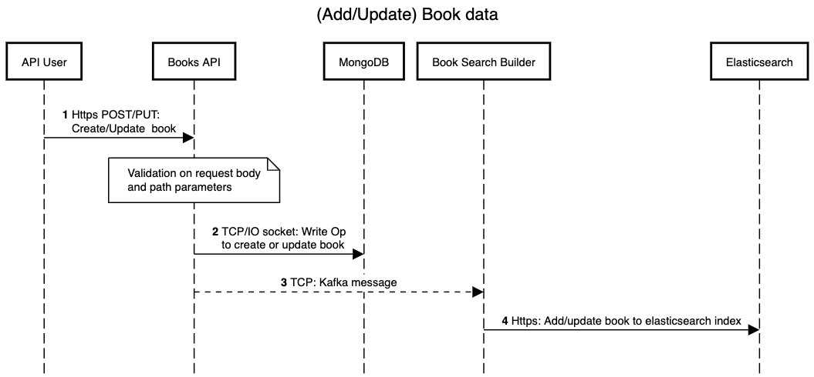

# Electronic Library Architecture Design

Source of truth for backend processing of book data.

## Sequence Diagrams

The source script for the each diagram is maintained in diagrams folder.

To update a diagram:
- Copy the source script into [sequencediagram.org](http://sequencediagram.org)
- Update a diagram as required
- Export as an image on [sequencediagram.org](http://sequencediagram.org)
- Copy the updated source script back into `diagrams/<name>.txt` and commit.

### Add/update book documents and add to search engine (Elasticsearch)

#### Steps

<TODO>